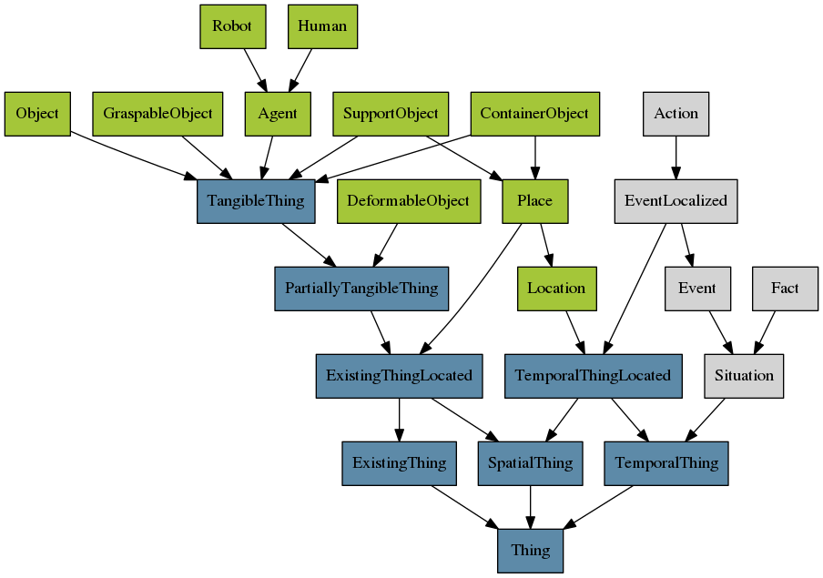

# uwds3_ontologenius_bridge
Underworlds reader for ontologenius

Very simple bridge that allow to request Underworlds entities with SPARQL-like queries thanks to [Ontologenius](https://github.com/sarthou/ontologenius).
The ontology used to describe Underworlds entities is adapted from [ORO-commonsense](http://kb.openrobots.org/)

# Classes

# Object properties

* belongsTo
* canBePerformedBy
* canPerform
* contains
* hasAllocentricPosition
* hasEgocentricPosition
* hasFeature
* hasAppearance
* hasColor
* hasShape
* hasSize
* isAt
* hasInHand
* inFrontOf
* isBehind
* isCloseTo
* isFocusOf
* isHeldBy
* isInside
* isOnTop
* isReachableBy
* isRightOf
* isLeftOf
* isVisibleBy
* lookAt
* owns
* reaches
* sees
* supports
